**Description et Instructions de l'Application Web:**
___
 

___**MediQueue**___ aide les administrateurs et les patients à mieux comprendre le temps d'attente aux urgences. 
 
 
Les administrateurs de l'hôpital enregistrent et gèrent la liste d'attenede des patients en fonction de deux critères de triage : __la gravité de la blessure et la durée de l'attente__ . Les utilisateurs, c'est à dire les patients, peuvent se connecter avec leur nom d'utilisateur et un code de trois lettres indiquant un temps d'attente approximatif, qui est mis à jour au fur et à mesure que les patients sont traités.
 
 
___
**Comment y accéder?**
 

<a>
<li>Télechargez Xampp, Node.js/npm</li>
<li>Déplacer le folder hospital-triage-services dans le folder htdocs de Xampp</li>
 

  
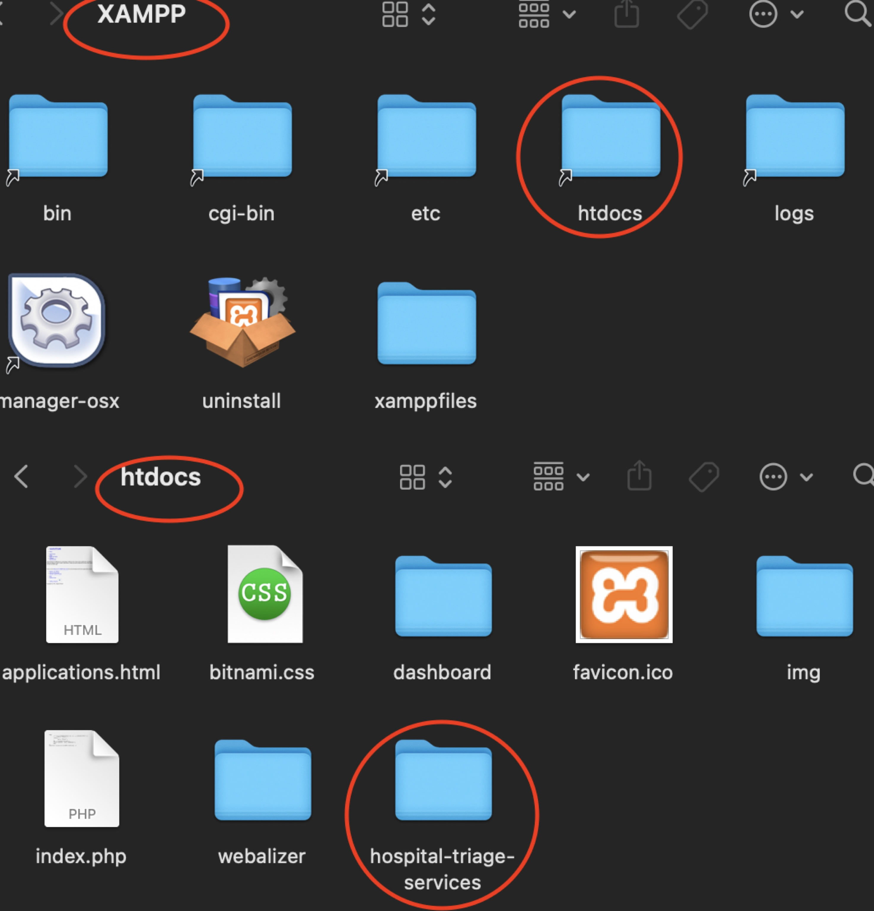
<li>Ouvrir Xampp et Start Apache & MySQL, des bouttons vers devraient aparaitre à coté de MySQL Database et Apache Web Server.</li>
 

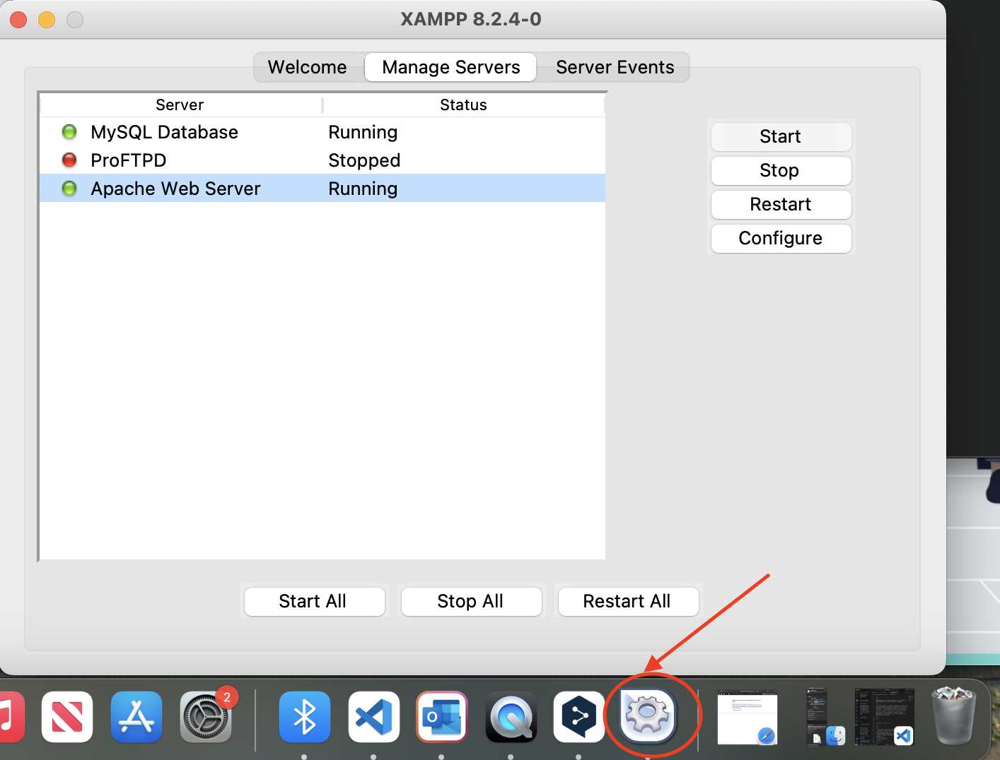
<li>Accéder à localhost/phpMyAdmin pour verifier si la base de donnée et bien en place</li> 

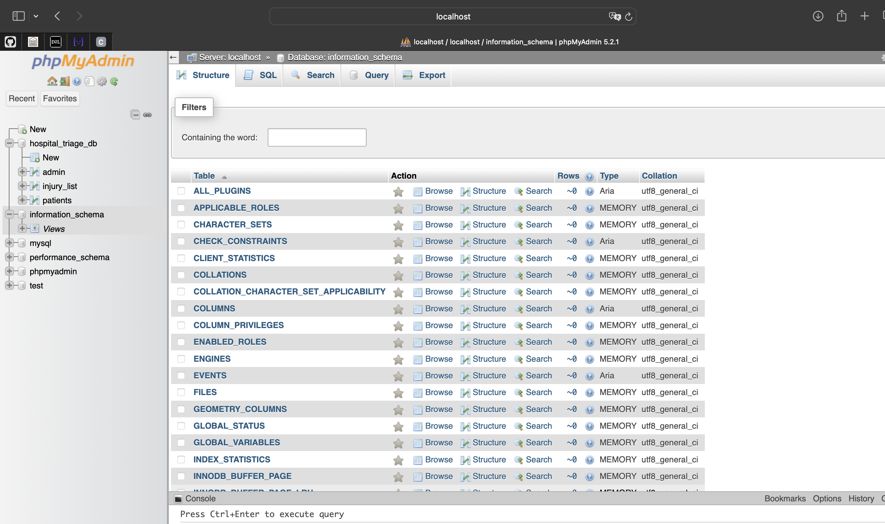
<li>Dans le terminal, accéder au path du fichier Mediqueue</li>
<li>Run npm install</li>
<li>Run npm start</li> 

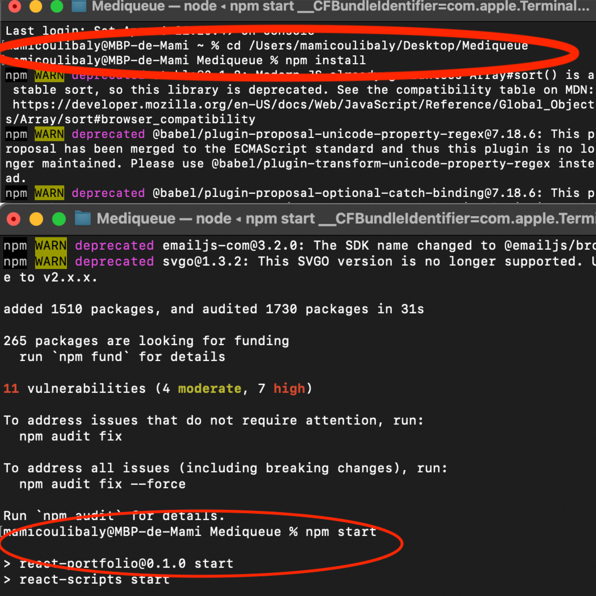
 
<li>La page Web s'ouvrira comme ci-dessous</li> 

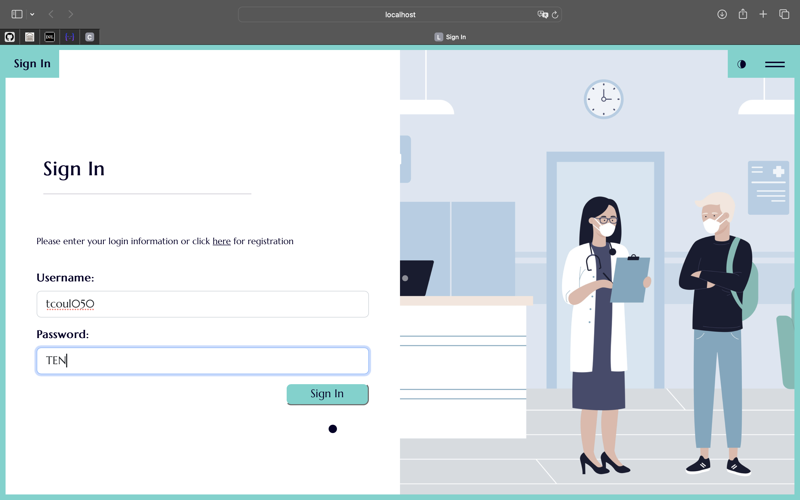
<li>Je me connecte ensuite à l'aide de mon nom d'utilisateur et mon mot de passe</li> 

</a>
___

En temps qu'administrateur, j'ai accès:
<li>Au Injury List</li> 

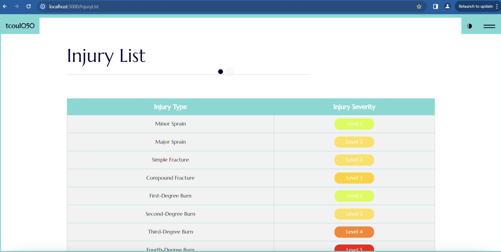
<li>Au Patient Board</li> 

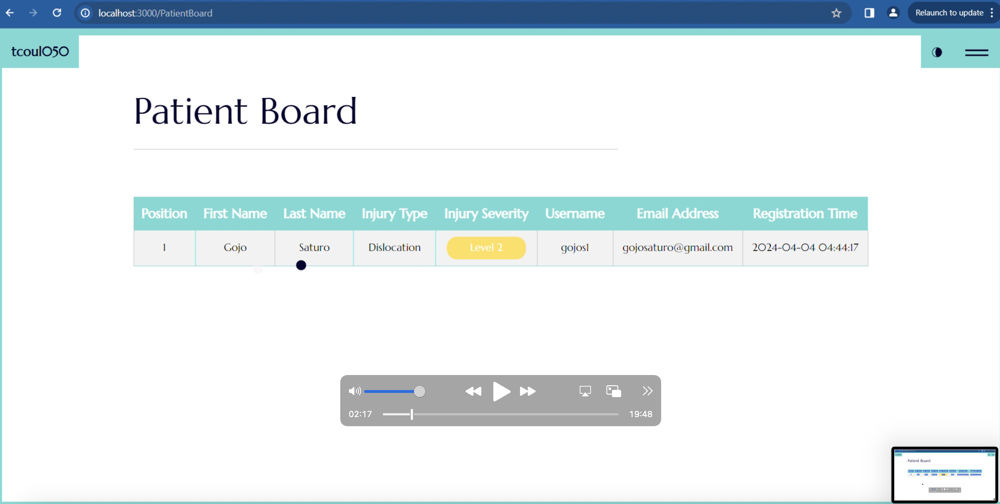
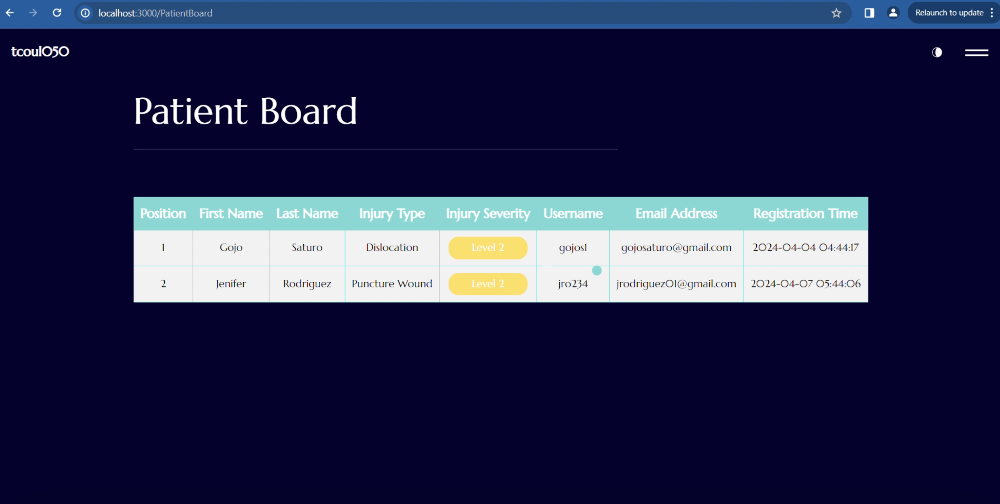
<li>Edit le patient Board, par exemple, ci-dessous j'ajoute un nouveau patient</li> 

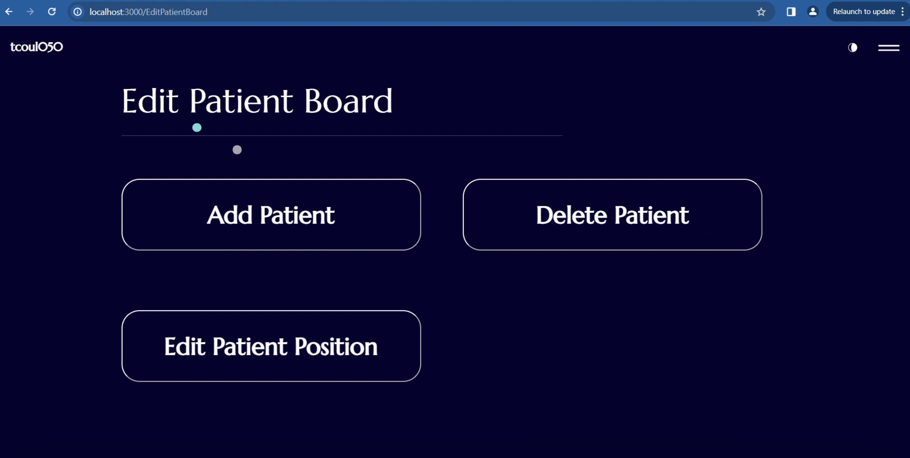
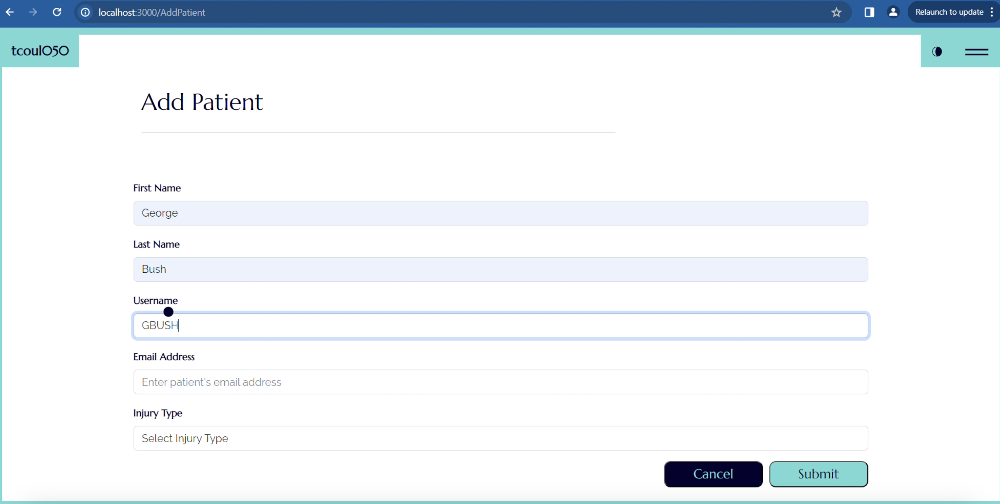
<li>Au Contact Page</li> 

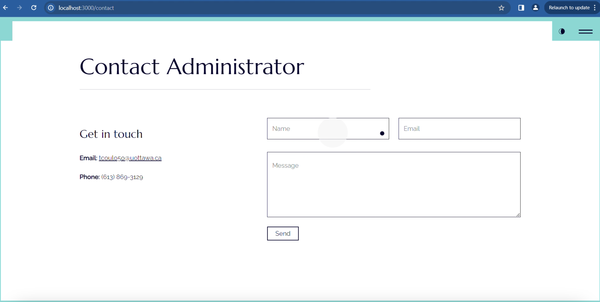
<li>Et aussi à d'autres fonctionnalités</li> 

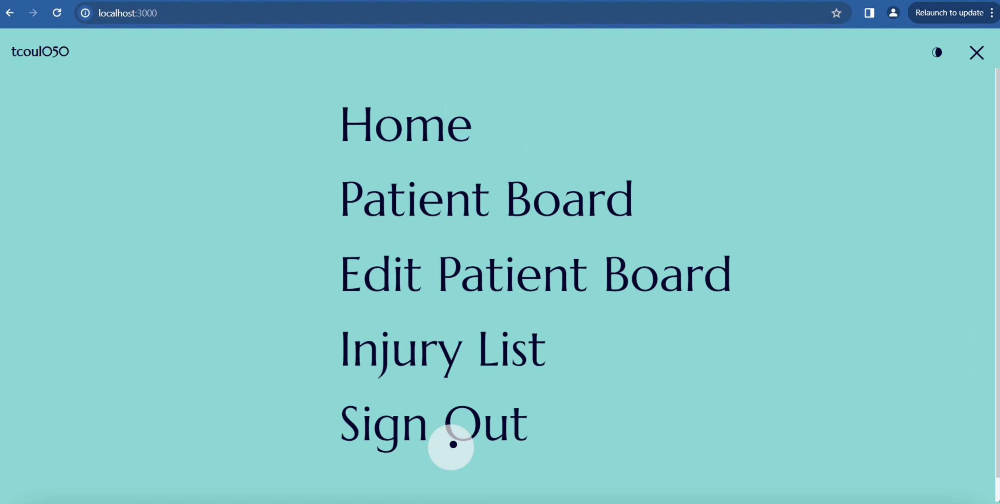
 
En temps qu'admistrateur, Je peut également enregistrer, modifier et accéder à toutes les données des patients dans ma base de donnée:

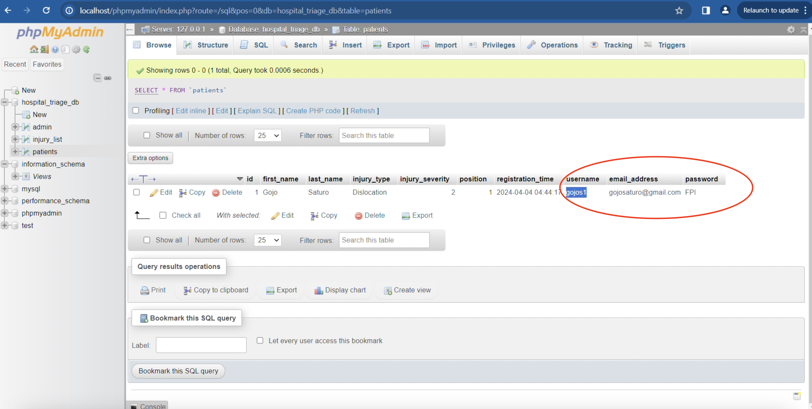

___
Les patients peuvent se connecter avec leur nom d'utilisateur et mot de passe.
 

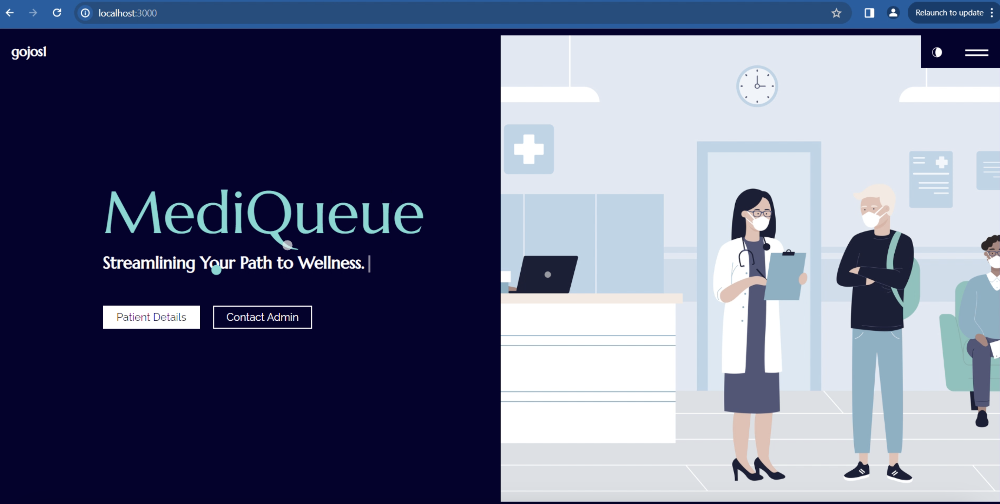
 
 
Les patients peuvent:
<li>Accéder au Patient Details</li> 

<li>Accéder à d'autees fonctionnalités</li> 

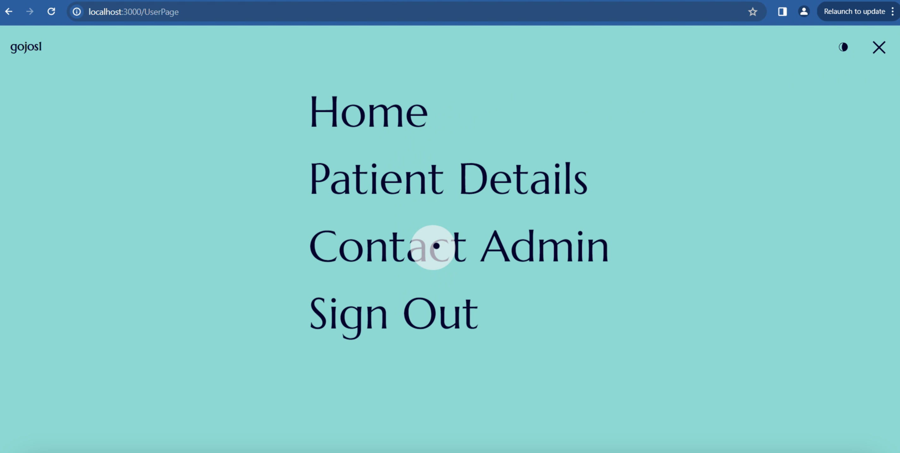
<li>Créer un compte et de connecter ensuite avec leur informations</li> 

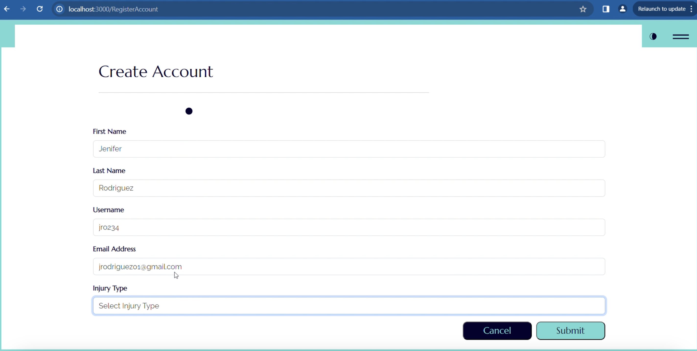
